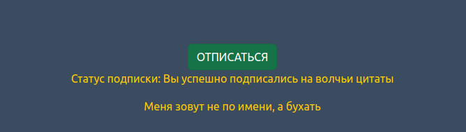

# Wolf-quotes aiohttp

## Эта программа рассылает волчьи цитаты если вы на них подписались.

Build project:
```bash
docker build -t wolf-quotes .
```

Run project:
```bash
docker run -dp 8080:8080 wolf-quotes
```

#### 1. Открываете папку app, открываете файл server, нажимаете на значёк запуска.

.

#### 2. Открываете браузер по адресу http://127.0.0.1:8080 

#### 3. Нажимаете подписаться и вам каждые 10 секунд будет приходить случайная волчья цитата.


#### 4. Если хотите перестать получать цитаты то нажмите отписаться.

